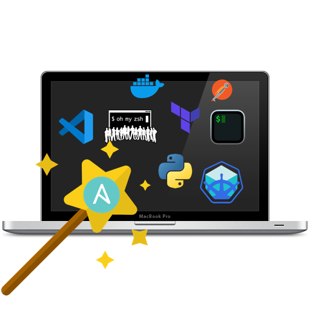

<p align="center"></p>

# 💻 DevOps Mac OS automated setup

This Ansible playbook installs and sets up most of the software and utilities for my DevOps environment.

## 🚥 Installation

First of all clone or download this repository on your mac.

After that, you need to do some things to install prerequisites.
You can simply run the [install.sh](install.sh) script which includes all commands for the installation prerequisites.

_Note: If some Homebrew commands fail, you might need to agree to XCode's license or fix some other Brew issue. Run brew doctor to see if this is the case._

I clone my **dotfiles** repo (`.zshrc`, `.aliases`, `.gitignore_global`, etc.) to enable some options and set up aliases, etc.

Of course, you can use yours by changing the `dotfiles_repo` variable in `default.config.yml` file.

## 🚀 Usage

Edit `default.config.yml` to customize the list of software to install
and just run the following command at the root of this project and enter your account password when prompted.

```sh
ansible-playbook setup-my-mac.yml -i inventory -K
```

## ✨What does this playbook do?

The complete list of software that the playbook is going to install is in `default.config.yml` , but in summary, here is what the playbook does.

- Install homebrew and cask and install applications, utilities and QuickLook plugins.
  (e.g. Docker, Terraform, Kubectl, slack, 1password, postman,...)
- Clone [dotfile](https://github.com/DemisR/dotfiles.git) from the Github repository.
- Install mas (Mac App Store command line interface)
- Configure terminal
  - Install [iTerm2](https://iterm2.com/) and [powerlevel10k](https://github.com/romkatv/powerlevel10k)
  - Install Zsh and configure options with [oh-my-zsh](https://ohmyz.sh/)
- Configure Mac OS
  - Show icons for hard drives, servers, and removable media on the desktop
  - Avoid creating `.DS_Store` files on network volumes
  - Finder: show status bar
  - Save screenshots in PNG format
  - Save screenshots to the Desktop/Screenshots folder

## Testing the Playbook

Currently, this project is not continuously tested on all versions and architectures of MacOS.
You can test it using MacOS VMs like:

- [UTM](https://mac.getutm.app)
- [Tart](https://github.com/cirruslabs/tart) (built for CI integrations)

## Similar projects and inspirations

- https://blog.vandenbrand.org/2016/01/04/how-to-automate-your-mac-os-x-setup-with-ansible/
- http://www.nickhammond.com/automating-development-environment-ansible/
- https://github.com/simplycycling/ansible-mac-dev-setup/blob/master/main.yml
- https://github.com/mas-cli/mas
- https://github.com/geerlingguy/mac-dev-playbook
- https://github.com/osxc
- https://github.com/MWGriffin/ansible-playbooks/blob/master/sourcetree/sourcetree.yaml
- https://github.com/sindresorhus/quick-look-plugins
